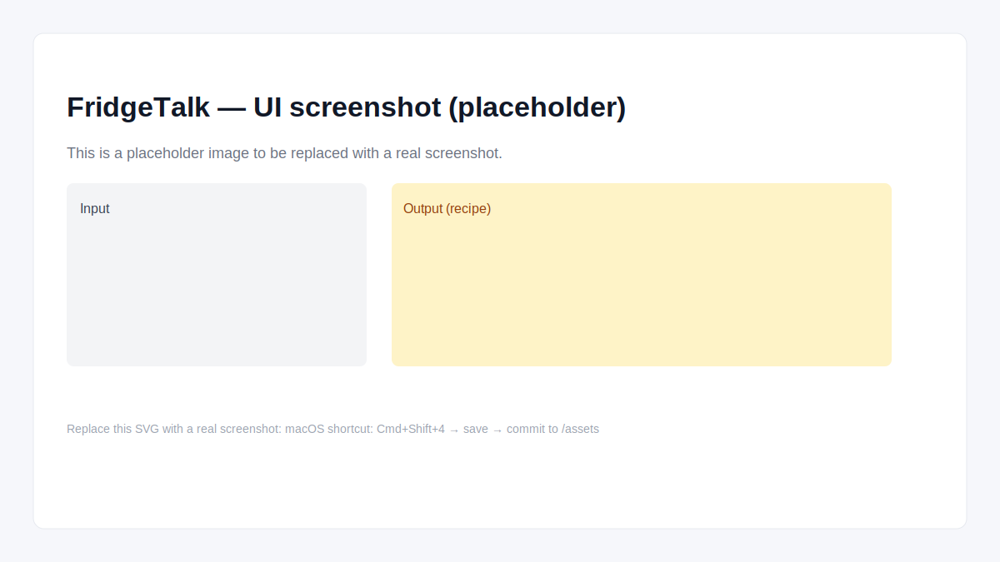

# 🧊 FridgeTalk Chat

Um chat inteligente que cria receitas automáticas com base nos ingredientes que você tem em casa.

### 💡 Como funciona:

1. Digite os ingredientes disponíveis.
2. O modelo gera uma receita criativa, com nome e modo de preparo.
3. Aproveite e compartilhe ideias!

### ⚙️ Tecnologias:

- Python
- Gradio
- OpenAI API
 
## Demo & Apresentação

Este repositório foi preparado para apresentação em processos seletivos. Se você não tiver uma chave de API ativa, o app roda em modo demo e mostra receitas de exemplo. O UI também exibe mensagens amigáveis para o recrutador quando o provedor de IA não está disponível.

## Try it

- Abra a Space do Hugging Face (link no seu perfil) para ver a versão hospedada.
---
title: "FridgeTalk Chat"
emoji: "🧊"
colorFrom: yellow
colorTo: purple
sdk: gradio
app_file: app.py
pinned: false
---

# 🧊 FridgeTalk Chat — Professional Demo

FridgeTalk helps users turn a few fridge ingredients into a practical recipe. This repo is prepared for interview/demo purposes: it includes a polished demo mode so you can show the product even if an AI key or quota is not available.

Key features
- Clean, responsive Gradio UI
- Demo-mode fallback (no external API required)
- Friendly user-facing error messages and guidance for reviewers
- Unit tests and CI

Badges
- CI (after pushing to GitHub): ``
- License: ``

Screenshot


Presentation notes for recruiters
- To highlight this project in an interview, open the hosted Space and: 1) Toggle demo mode to show instant recipes; 2) Type a short list of ingredients and click "Gerar receita" — the UI will show a clean assistant response and an example fallback message if IA is unavailable.
- Tip: Replace `assets/screenshot-placeholder.svg` with a real screenshot before sending the link to recruiters. To capture a screenshot on macOS: Cmd+Shift+4 → select area → save PNG → commit to `assets/`.

Technologies
- Python 3.10+
- Gradio
- OpenAI (optional; disabled by default)

Quick demo (for recruiters)
1. Open the hosted Hugging Face Space (link on my profile) to see the running demo.
2. If you prefer to run locally, clone and install the requirements below.

Run locally
```bash
git clone <your-repo-url>
cd fridge-talk
python -m venv .venv
source .venv/bin/activate
pip install -r requirements.txt
python app.py
```

Open http://localhost:7860 to view the interface.

Demo mode
- Toggle "Usar modo demo" in the UI to generate sample recipes without any API key.
- Or set the environment variable:

```bash
export DEMO_MODE=1
python app.py
```

Using a real AI provider
- To enable OpenAI, add `OPENAI_API_KEY` to your Hugging Face Space Secrets or export it locally before running.

Repository contents
- `app.py` — main Gradio application with demo fallback and friendly errors
- `requirements.txt` — pinned dependencies
- `tests/` — unit tests (pytest)
- `.github/workflows/ci.yml` — simple CI to run tests on push
- `LICENSE` — MIT

Presenting to recruiters
- The hosted Space shows a clean UI and friendly explanatory text for reviewers.
- The repository includes a test suite and CI so you can demonstrate development best-practices.

Contributing
- See `CONTRIBUTING.md` for quick guidelines.

License
- MIT — see `LICENSE`
