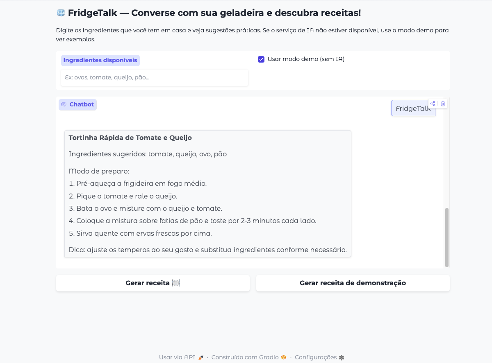

# 🧊 FridgeTalk Chat

> Assistente simples para sugerir receitas com base nos ingredientes da sua geladeira.

## Visão geral
- **Entrada**: texto com ingredientes (ex.: ovos, tomate, queijo)
- **Saída**: nome da receita + modo de preparo passo a passo
- **Comportamento**: usa OpenAI quando configurado e faz fallback automático para o modo demo

## Recursos principais
- 🎛️ Interface com sugestões rápidas de ingredientes e dicas embutidas
- 🔁 Fallback inteligente para demo quando o provedor de IA não está acessível
- 🧪 Testes unitários cobrindo mensagens e fluxo demo

## Captura


## Como executar localmente
```bash
git clone <seu-repo-url>
cd fridgetalk-chat
python3 -m venv .venv
source .venv/bin/activate
pip install -r requirements.txt
python app.py
```
Abra http://localhost:7860 no navegador.

### Executar testes
```bash
python3 -m pytest -q
```

## Modos de execução
### Demo Mode
- Marque **“Usar modo demo (sem IA)”** na interface, ou
- Execute com a variável:
  ```bash
  export DEMO_MODE=1
  python app.py
  ```

### OpenAI (opcional)
- Exporte `OPENAI_API_KEY` ou configure como Secret no Hugging Face Space.
- O aplicativo entrega uma mensagem amigável quando não encontra a chave e volta ao demo automaticamente.

## Estrutura do repositório
- `app.py` – aplicação Gradio com fallback e logging
- `tests/` – testes unitários (pytest)
- `assets/` – imagens do projeto
- `.github/workflows/ci.yml` – workflow de testes
- `requirements.txt` – dependências principais
- `LICENSE` – MIT

## Deploy na Hugging Face Space
- O front matter no topo deste README já está pronto para Spaces (SDK Gradio + `app.py`).
- Configure variáveis (`OPENAI_API_KEY`, etc.) em **Settings → Variables & secrets**.
- Use `PRESENTATION.md` para gravar um GIF/MP4 curto e atualize `assets/demo.png` (ou adicione `assets/demo.gif`).
- Em macOS com Python 3.14+, instale `libjpeg` (`brew install jpeg`) antes de `pip install -r requirements.txt` para evitar erros do Pillow.

## Boas práticas para apresentação
- Use o modo demo para respostas instantâneas durante demonstrações.
- Mostre a mudança de comportamento ao adicionar a chave OpenAI.
- Mantenha o navegador focado na interface para destacar o chatbot.

## Contribuições
Consulte `CONTRIBUTING.md` para orientação sobre issues, PRs e estilo de commits.

## Licença
Distribuído sob a licença MIT. Veja `LICENSE` para detalhes.
